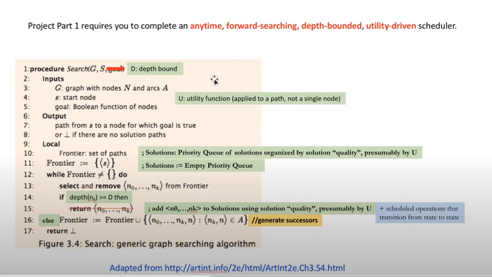
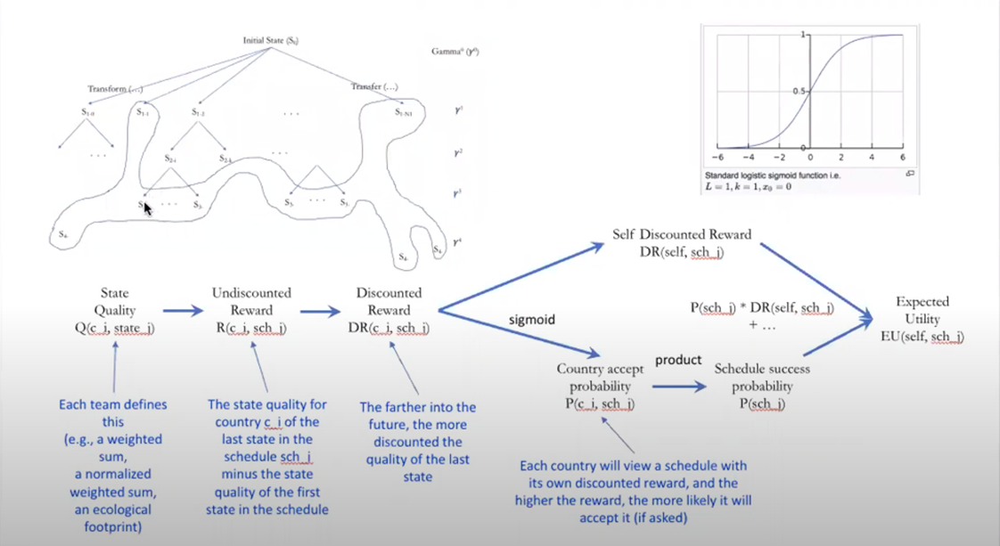
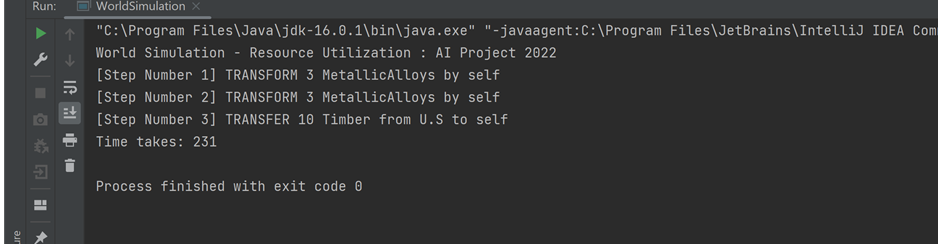
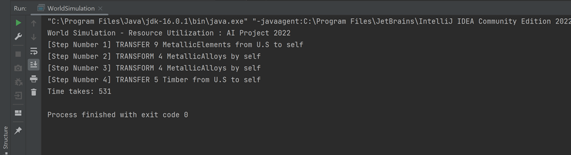
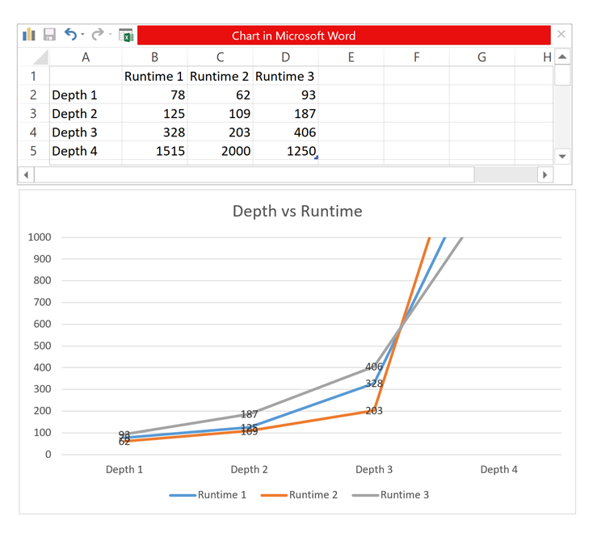

# World Simulation
The project is to build a multi-method AI that plans and models trading and development (e.g., farming, manufacturing) decisions for respective virtual countries, each country with virtual resources and incentives for cooperating and competing with other countries.

## Search: Generic Graph Search Algorithm

## Discounted Reward Algorithm

## Output of the Project
Country size = 2 and depth = 3

Country size = 2 and depth = 4

## Depth vs Runtime

## How to Run the Project
- Download or Clone form the repository
- Open with IDE
- Open WorldSimulation
- Run the project
